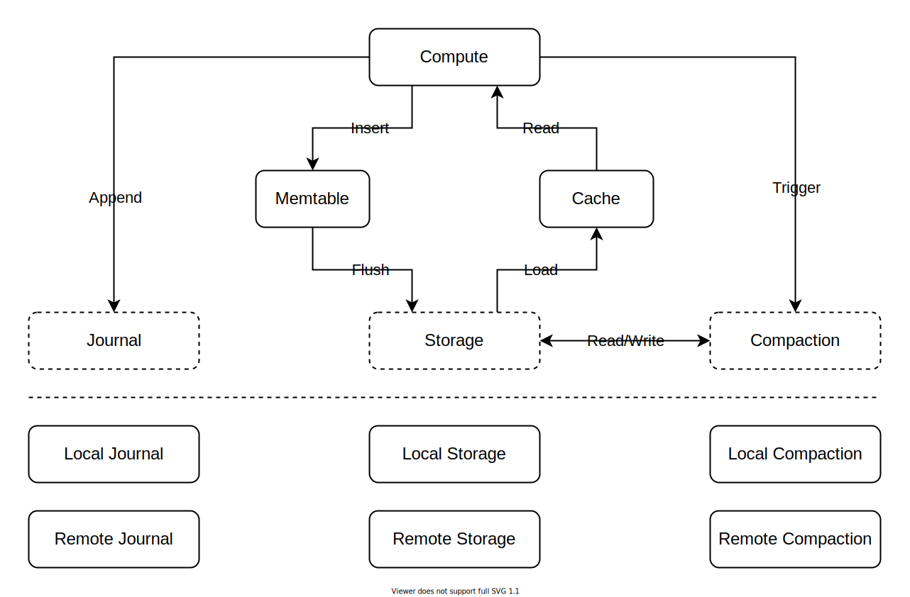
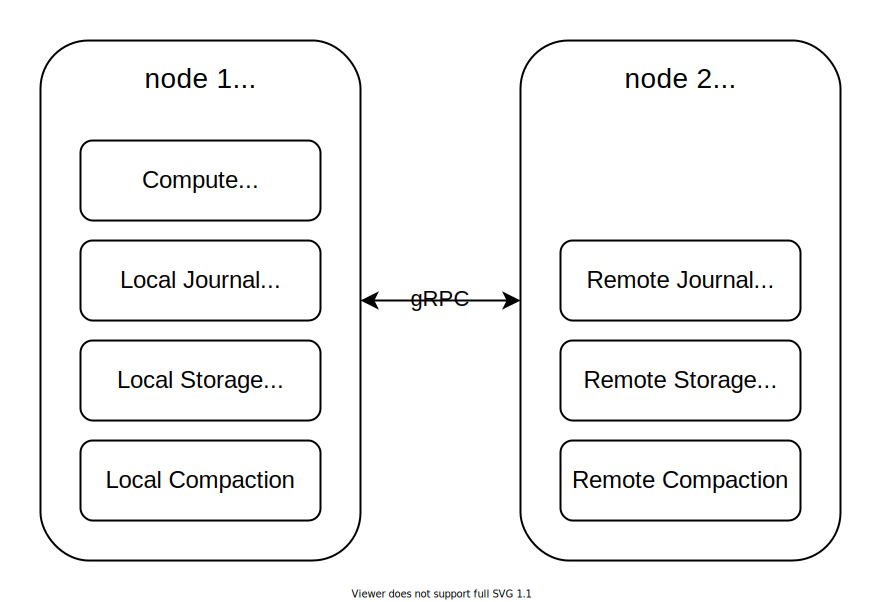

# Demo 1: Towards an Elastic Storage Engine

Last month, we finished our first demo and evaluated it on AWS.
This demo is a proof of concept about an elastic storage engine on the cloud.

In this post, we first describe the architecture and implementation of the demo.
We then describe the experiments we conducted on the demo and share some lessons we learned.

## Architecture and Implementation

The architecture of the demo is as follow:

The top half shows a classic LSM-Tree structure similar to RocksDB.
However, the implementation is much simpler due to the limited time and workforce.
Specifically, we only support single key-value `Put` and `Get`.
For puts, all entries are first appended to the journal and then inserted into the memtable.
When the size of the memtable reaches a threshold, the database flushes it to a file in the storage.
When the number of files in the storage reaches a threshold, the database triggers compactions to merge small files into larger ones.
For gets, the database examines the mutable memtable, the immutable memtable, and individual storage files in order (there are no filters).
Moreover, to achieve concurrent flushes and compactions, we hash the memtable and the storage into a few shards.

The bottom half is what makes the demo interesting.
It shows the major difference between the demo and other traditional storage engines.
First, we unbundle the journal, storage, and compaction components, enabling us to switch each component to another implementation without affecting others.
Then for each component, we provide a local implementation and a remote implementation.
The local implementation runs in the same process with the database, while the remote implementation wraps the local one into a gRPC service that runs as a standalone process.

For more implementation details, please check the code [here](https://github.com/engula/engula/tree/demo-1).

## Evaluation

Now let's evaluate the demo we described above.
Our goal here is to explore the potential of an elastic storage engine while comparing it to a traditional one.
We should note that the demo's absolute performance doesn't matter a lot.
The demo's implementation is over-simplified, so its absolute performance provides no reference value outside of it.

In the following sections, we conduct two groups of experiments on the demo.
The first group compares the performance between local and remote components with a simple deployment.
The second group employs a more sophisticated deployment to demonstrate a cloud-native architecture specific to AWS.

### Local versus Remote

Let's start with a simple deployment.
We run local and remote components on two different EC2 instances of the same type to make the comparison straightforward.
Specifically, we choose two `r6gd.2xlarge` instances located at `us-east-2`.
Each `r6gd.2xlarge` instance comes with a local SSD.
In addition, we attach a `gp3` EBS (5000 IOPS and 500MB/s throughput) to each instance.
This extra disk allows us to separate the journal and the storage to reduce IO interference.
As for the network performance between these instances, the latency is about 0.1ms, and the bandwidth is up to 10 Gbps.

The deployment is as follow:

We also develop a purpose-built [benchmark tool](https://github.com/engula/engula/blob/demo-1/engula/bin/engula.rs) that allows us to switch between local and remote components in a configuration file.
For all experiments in this section:

- The benchmark tool always runs on node 1.
- For the local setup, the local journal, storage, and compaction run in the same process with the benchmark tool on node 1.
- For the remote setup, the remote journal, storage, and compaction run as standalone processes on node 2, and the benchmark tool communicates with them through gRPC.

Moreover, due to some limitations in the demo, we evaluate read-only and write-only performance separately.

#### Put

Now let's evaluate the `Put` performance with the local and remote setups.
For more details about the specific setups, please check the [local](https://github.com/engula/engula/blob/demo-1/engula/etc/put-local.toml) and [remote](https://github.com/engula/engula/blob/demo-1/engula/etc/put-remote.toml) configuration files.

The benchmark results *without compactions* are as follows:

| Table 1 | QPS | Latency (P95/P99/P999) | CPU Usage (Sum of two nodes) |
|---------|-----|------------------------|------------------------------|
| Local   | 1.01 million | 9.2/12.0/17.5 ms | 7.4 cores |
| Remote  | 1.04 million | 9.3/12.2/17.7 ms | 9.6 cores |

Figures 1-3 show the runtime statistics of the local setup (on the left) and the remote setup (on the right).

**First of all, we are excited to see that both setups achieve more than 1 million puts per second with `sync` enabled.**
As far as we know, 99% of applications never reach 1 million puts per second throughout their lifetime, which means that a well-optimized database can serve all these applications with a single compute node.
We also notice that there are some fluctuations in Figures 1 and 3.
These fluctuations occur whenever the memtable is flushed, which is expected due to the depleted CPU on node 1 (8 cores).

On the other hand, Table 1 shows that the remote setup achieves similar QPS and latency as the local one.
**However, the remote setup consumes 30% more CPU due to extra work on RPC and networking, which makes the remote setup unappealing in such a scenario.**

Next, we enable compactions and rerun the benchmarks.

| Table 2 | QPS | Latency (P95/P99/P999) | CPU Usage (Sum of two nodes) |
|---------|-----|------------------------|------------------------------|
| Local   | 0.80 million | 11.7/15.5/35.2 ms | 7.6 cores |
| Remote  | 0.99 million |  8.4/11.2/21.4 ms | 12.4 cores |

**This time, the local setup performs worse than before because compactions introduce excessive CPU contentions on node 1.**
In contrast, the remote setup performs similarly well because node 2 still has sufficient CPU for compactions.
But we need to consider what we pay and what we get here.
**Table 2 shows that the remote setup pays 63% more CPU for 25% higher QPS, which may or may not be a cost-effective deal depending on the application.**

Nevertheless, the remote setup does make the storage engine more elastic.
Imagine that as the dataset grows, we can partition the remote components and scatter them into multiple nodes.
In this way, we can extend the capability of a database with a single compute node as much as possible to avoid distributed transactions.

#### Get

Now let's evaluate the `Get` performance with the local and remote setups.
For more details about the specific setups, please check the [local](https://github.com/engula/engula/blob/demo-1/engula/etc/get-local.toml) and [remote](https://github.com/engula/engula/blob/demo-1/engula/etc/get-remote.toml) configuration files.

It is important to note that we keep all storage files in memory during the following experiments, which is a compromise due to Rust's lack of support for asynchronous random access file IO and our limited human resources.
We decide to live with that because IO performance is not our primary concern here.

The benchmark results *without cache* are as follows:

| Table 3 | QPS | Latency (P95/P99/P999) | CPU Usage (Sum of two nodes) |
|---------|-----|------------------------|----------------------------------|
| Local   | 0.68 million | 0.03/0.03/0.03 ms | 8.0 cores |
| Remote  | 0.10 million | 3.1/3.7/6.6 ms    | 10.5 cores |

Figures 7-10 show the runtime statistics of the local setup (on the left) and the remote setup (on the right).

For the local setup, the latency is very low since all data stays in memory.
Hence, the benchmark is entirely CPU-bound, and it squeezes all CPUs on node 1.

For the remote setup, the performance is much worse than the local one.
The reason for this bad performance is apparent, though.
Without cache, every read involves one or more RPCs to retrieve data blocks from the remote storage.
Figure 10 shows that the network bandwidth exhausts, although both nodes still have some spare CPU.
This situation is very undesired because if the network bandwidth of the compute node becomes the bottleneck, all remote components are affected, and adding more nodes is not going to help.

**Therefore, we have to admit that using remote storage without cache is not practical.**

So let's enable cache and rerun the benchmarks.

| Table 4 | QPS | Latency (P95/P99/P999) | CPU Usage (Sum of two instances) |
|---------|-----|------------------------|----------------------------------|
| Local    | 0.70 million | 0.03/0.03/0.05 ms | 8.0 cores |
| Remote   | 0.72 million | 2.0/6.2/12.3 ms   | 8.8 cores |
| Remote 2 | 1.41 million | 0.1/7.1/13.2 ms   | 15.8 cores |

According to our statistics, the cache we introduce provides a 0.98 cache hit ratio, which boosts the performance of the remote setup to the same level as the local one.
**However, the remote setup still suffers a long-tail latency, which is inevitable unless we cache all data on the compute node.**

On the other hand, Figure 13 shows that node 1 becomes the bottleneck of both setups now.
But node 2 is almost idle here.
So can we do something with it?
Well, we can run benchmarks on both nodes against the same set of remote components.
This setup simulates the use case of running multiple read replicas on a cloud database.

Table 4 (Remote 2) shows the result of running benchmarks on node 1 and node 2 concurrently against the same set of remote components.
**We successfully utilize all CPUs on both nodes and achieve 1.41 million gets per second.**
**This setup reveals the advantage of remote components, providing flexible ways to leverage available resources across nodes.**

### Cloud-Native Architecture

While the first group of experiments gives some insights about the demo, they haven't shown the big picture yet.
In previous experiments, we run the remote journal, storage, and compaction on the same node, which is not required.
We can be more aggressive in separating these components into individual nodes and choose appropriate instance types and disks.

Furthermore, the demo provides other kinds of storage components that make things more interesting:

- SSTable storage: stores files in [SSTable](https://www.igvita.com/2012/02/06/sstable-and-log-structured-storage-leveldb/) format on file system or S3
- Parquet storage: stores files in [Parquet](https://parquet.apache.org/) format on file system or S3
- Hybrid storage: provides an abstraction to read, write, and `SELECT` files on different storage components

To showcase these components, we construct a hybrid storage on top of an SSTable storage on a local file system and a Parquet storage on S3.
Specifically, whenever the memtable is flushed, the hybrid storage writes one copy to the SSTable storage and another copy to the Parquet storage.
The hybrid storage always reads from the SSTable storage to serve row-oriented, latency-sensitive reads.
On the other hand, the benefits of adding the Parquet storage here are threefold:

- Offloads compaction reads from the SSTable storage to make it more stable.
- Leverages S3 to improve durability at low cost.
- Leverages S3 `SELECT` command to serve analytical workloads efficiently.
  We can even merge the memtable with the results from Parquet files on S3 to provide *real-time, strongly consistent* analytical services, which gives us a promising architecture for HTAP.

Finally, we get a cloud-native architecture as follow:

#### Deployment

To make a cost-effective deployment for the architecture above, we need to understand the characteristics of different components first:

- The journal requires minimal CPU and memory.
  But it can benefit from a premium disk to write at low latency.
- The storage requires a medium amount of CPU and memory and a disk with enough capacity and decent performance.
- The compaction requires a medium amount of CPU and memory but doesn't need any instance storage.
  Moreover, since compactions are background jobs that can fail without affecting foreground services, they don't require reliable resources.
  AWS provides EC2 Spot Instances at up to a 90% discount for such fault-tolerant workloads.
- The compute/benchmark requires a large amount of CPU and memory, and it has to run reliably.

Moreover, let's assume that we are running an OLTP workload that writes at 200MB/s in 1KB value size.
Given such a workload and the characteristics above, we decide to give the following setup a try:

| Component  | Instance name | Hourly cost | vCPU | Memory | Storage | Network bandwidth |
|------------|---------------|-------------|------|--------|---------|--------------------|
| Compute    | m5.2xlarge    | $0.384  | 8 | 32 GiB  | | Up to 10 Gbps |
| Journal    | t3.nano       | $0.0052 | 2 | 0.5 GiB | io2 (2000 IOPS) | Up to 5 Gbps |
| Storage    | r5.xlarge     | $0.252  | 4 | 32 GiB  | gp3 (5000 IOPS, 500MB/s) | Up to 10 Gbps |
| Compaction | r5.xlarge     | $0.0418 (Spot Instance) | 4 | 32 GiB | | Up to 10 Gbps |

#### Benchmark

Now it's time to see if our beautiful architecture and deployment work.
For more details about the specific setup, please check the [configuration file](https://github.com/engula/engula/blob/demo-1/engula/etc/cloud-native.toml).
To make things simple, we only evaluate `Put` performance here.
The `Get` performance of this architecture should be similar to the remote setup above, so we will not discuss it further.

The benchmark results for `Put` are as follow:

Well, it works.
But only for a little while, unfortunately.
Then the QPS drops, and the latency raises horribly.
Don't panic. Let's see what's wrong here and fix it.
Figure 17 shows that the CPU usage is very low, far from the limits of our instances.
Figure 18 shows that the disk bandwidth is also very low, far from the limits of our provisioned disks.
So what's left is the network bandwidth, which also looks very low in Figure 19.
Hmm, we must miss something here.

It turns out that we neglect a critical factor about the network bandwidth of our instances.
The "network bandwidth" listed in the table above doesn't tell us all the truth.
AWS uses [a network I/O credit mechanism](https://docs.aws.amazon.com/AWSEC2/latest/UserGuide/ec2-instance-network-bandwidth.html).
**In simple terms, network bandwidth of "Up to 10 Gbps" gives us no guarantee at all.**
**What we can rely on is the network baseline bandwidth, not the network bandwidth.**
So we need to find out the baseline bandwidth of our instances:

| Component  | Instance name | Hourly cost | Network bandwidth | Network baseline bandwidth |
|------------|---------------|-------------|-------------------|----------------------------|
| Compute    | m5.2xlarge    | $0.384  | Up to 10 Gbps | 2.5 Gbps |
| Journal    | t3.nano       | $0.0052 | Up to 5 Gbps  | **0.032 Gbps** |
| Storage    | r5.xlarge     | $0.252  | Up to 10 Gbps | 1.25 Gbps |
| Compaction | r5.xlarge     | $0.0418 | Up to 10 Gbps | 1.25 Gbps |

As we can see, `t3.nano` for the journal only provides a 0.032 Gbps (4MB/s) baseline bandwidth, which explains the result we get in Figure 19 very well.
But what about the initial high performance we observe?
That comes from the credits AWS gives the instance when its usage is below the baseline bandwidth.
However, the credits are limited, which only allows the instance to burst for a little while.
**Once the credits exhaust, the network bandwidth drops to the baseline.**

Therefore, we should carefully review the network baseline bandwidth of our previous setup.
Specifically, to process 200MB/s write throughput for the assumed workload, we need at least 1.6 Gbps network bandwidth.
In addition, we have to consider the write amplification of different components:

- The compute writes to the journal, flushes to the SSTable storage and the Parquet storage.
  So the minimal bandwidth it requires is 1.6 * 3 = 4.8 Gbps.
- The journal only needs 1.6 Gbps to receive writes from the compute.
- The storage receives writes from both the compute and compaction, so it requires 3.2 Gbps.
- The compaction reads from the Parquet storage and then writes to both the SSTable and Parquet storage, which requires 3.2 Gbps.

So, to satisfy the above requirements, we decide to upgrade our setup as follow:

| Component  | Instance name | Hourly cost | Network bandwidth | Network baseline bandwidth |
|------------|---------------|-------------|-------------------|----------------------------|
| Compute    | m5n.2xlarge   | $0.476  | Up to 25 Gbps | 8.125 Gbps |
| Journal    | m5n.large     | $0.119  | Up to 25 Gbps | 2.1 Gbps |
| Storage    | r5n.xlarge    | $0.298  | Up to 25 Gbps | 4.1 Gbps |
| Compaction | r5n.xlarge    | $0.0418 | Up to 25 Gbps | 4.1 Gbps |

**This setup costs us 38% more than the previous one.**

Now let's rerun the benchmark with this setup to see if it is worth it.

**Awesome, we finally get everything work as expected!**
We accomplish our goal to deliver 200,000 puts per second in 1KB value size, which is 200MB/s.
The latency also looks OK with P99 at about 10ms.
Figure 23 shows that the network throughput of the compute (the purple one) is less than expected (200MB/s * 3).
That's because the Parquet storage compresses our files very well.

**On the other hand, we have to note that the resource allocation of this setup is still not optimal.**
For example, we have to choose `m5n.large` for the journal instead of `t3.nano` to get enough network bandwidth.
But `m5n.large` costs 20 times as much as `t3.nano`, and the journal will never use the extra memory on it.

**Besides, the network bandwidth calculation of individual components above is very conservative.**
For applications that require high durability and availability, we may need three copies of the journal and the storage, which brings 6X write amplification to the compute node.
Furthermore, as the dataset grows, the compaction has to work more aggressively to maintain a decent read performance.
For a typical OLTP application, the estimated write amplification caused by compactions can be 10X.
It will be very challenging to choose appropriate instance types to get optimal resource allocation for different components with such conditions.
We can think of two possible solutions to reduce network bandwidth for now.
The first one is to enable compression to trade CPU for network bandwidth.
The second one is to allow the storage to run some compactions locally when necessary.

As for S3 SELECT, we can't always get it to work because [something](https://github.com/awslabs/aws-sdk-rust/issues/239) is wrong with the AWS SDK for Rust.
What we can say is that the basic idea works in our tests.

## Conclusion

Well, that's all we did and learned last month in this demo.
The conclusions we get so far are as follow:

- A well-optimized database on a single node is capable of serving most real-world applications.
  We should strive to build a storage engine that runs blazing fast on a single node first.
- The unbundled, cloud-native architecture we propose does work but requires considerably more CPU and network bandwidth.
  There is no silver bullet. A cloud-native architecture may or may not be cost-effective depending on the workload.
  But we are sure that an unbundled storage engine provides flexible ways to leverage resources across multiple nodes.
- For the read performance, using remote storage without cache is not practical due to the excessive network bandwidth it requires.
  We should try our best to avoid unnecessary cache misses, which is the key to reduce long-tail latency.
- For the write performance, background jobs like flushes and compactions have significant effects on stability.
  We should pay attention to the runtime (in particular, the asynchronous runtime in Rust) of the compute node to reduce the interference caused by background jobs.
- Network bandwidth is a bigger problem than we thought.
  Being too aggressive in separating every component into different nodes may not be beneficial.
  We should be more deliberate before going too far on this way.
- Rust's ecosystem is much better than before.
  Thanks for awesome projects like [tokio](https://github.com/tokio-rs/tokio), [tonic](https://github.com/hyperium/tonic), [tracing](https://github.com/tokio-rs/tracing), and [opentelemetry](https://github.com/open-telemetry/opentelemetry-rust), etc.
  However, it still lacks support for asynchronous file IO, and the AWS SDK for Rust is also too young for production.
  But we believe that fixing these problems is just a matter of time.

In the end, we are very proud of our achievements in such a short time and workforce.
We also want to thank our early contributors for participating in such an immature project.

## What's Next

In this demo, we have explored the path towards an elastic storage engine, which is our first design goal.
Our second design goal is to make the storage engine adaptive, which means that it should adjust its internal data structure to optimize for dynamic workloads.

**So, in the next demo, we will explore the path towards an adaptive storage engine.**
The next demo will be more challenging than ever because we haven't found any practical references in the industry yet.
We still need some time to figure out the roadmap and will share it on [Github](https://github.com/engula/engula) as soon as possible.
Meanwhile, if you want to know how it may look in advance, you can check [this paper](https://stratos.seas.harvard.edu/publications/design-continuums-and-path-toward-self-designing-key-value-stores-know-and).
