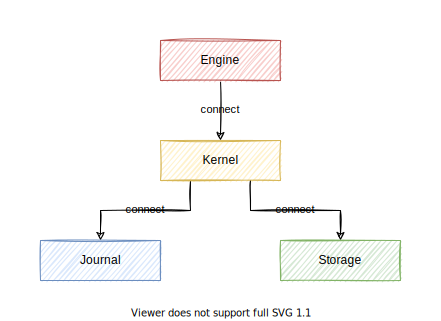

# Tutorial 0.2

Welcome to the tutorial for Engula 0.2! In this tutorial, we'll show you how to use an Engula engine.

## Prerequisites

- [rustup](https://rustup.rs/)
- Engula requires a nightly toolchain to build. You can install a nightly toolchain with:
  ```
  rustup install nightly
  ```

## Let's go

First of all, create a new project with:

```sh
cargo new hello-engula
cd hello-engula
```

Then in `Cargo.toml`, add `engula` and `tokio` to the dependencies section:

```toml
[dependencies]
engula = "0.2"
tokio = "1.14"
```

## Hash engine

Engula 0.2 comes with a hash engine that provides simple key-value storage. You can use the hash engine in `src/main.rs`:

```rust
use engula::engine::hash::{Engine, Result};
use engula::kernel::mem::Kernel;

#[tokio::main]
async fn main() -> Result<()> {
    let kernel = Kernel::open().await?;
    let engine = Engine::open(kernel).await?;

    println!("✊ Here we go!");
    let key = vec![0];
    let value = vec![1];
    println!("👉 Put {:?} {:?}", key, value);
    engine.put(key.clone(), value.clone()).await?;
    let got = engine.get(&key).await?;
    println!("👉 Get {:?} {:?}", key, got);
    println!("👉 Del {:?}", key);
    engine.delete(key.clone()).await?;
    let got = engine.get(&key).await?;
    println!("👉 Get {:?} {:?}", key, got);
    println!("🤟 Engula works!");

    Ok(())
}
```

Now, you can run the example with:

```sh
cargo +nightly run
```

That's it. You have successfully run an Engula engine! Let's see what happened here. In the above example, you open a kernel and run an engine on it. Then you use the engine to do some normal `get`/`put`/`delete` operations. The engine stuff should be very intuitive if you have used any other storage engines before. But what does the kernel mean here?

## Local kernel

In Engula, a kernel provides a stateful environment for an engine. An engine runs on a kernel and stores all its data in the kernel. You can run an engine on different kernels according to your use case. For example, the above example uses a memory kernel that stores everything in memory. The memory kernel is handy for tests, but if you restart the kernel, everything is gone. If that's not what you want, Engula 0.2 also provides a file kernel that stores everything in local files.

To use the file kernel, you need to replace `engula::kernel::mem::Kernel` with `engula::kernel::file::Kernel` like this:

```rust
use engula::engine::hash::{Engine, Result};
use engula::kernel::file::Kernel;

#[tokio::main]
async fn main() -> Result<()> {
    // Opens a file kernel that stores data in the given path.
    let kernel = Kernel::open("/tmp/engula").await?;
    let engine = Engine::open(kernel).await?;
    ...
}
```

You can run it again and see what it will done to your `/tmp/engula`.

Nice, you have tried two kernels now, and everything just works. But a storage engine that can store data in memory and local files doesn't seem very exciting, right? Fine, but don't worry, we get a third kernel for you, a gRPC kernel. This kernel is more interesting because it makes Engula very different from other storage engines you may ever seen.

## Remote kernel

A gRPC kernel allows you to run an embedded engine along with your database while storing data in a remote kernel. The remote kernel, in turn, stores data in a remote journal and a remote storage. But you don't need to know how they work for now. You just need to understand their relationship to connect them together.



Simply speaking, to use a gRPC kernel, you need to start a journal server and a storage server first. Then start a kernel server that connects to the journal server and the storage server. After that, you can connect to the kernel server and run your engine on it. Engula 0.2 provides an `engula` binary to start those servers. It's not complicated. Let's try it out!

You need to install the `engula` binary first:

```sh
cargo +nightly install engula
```

Then start a journal server and a storage server:

```sh
engula journal run 127.0.0.1:10001 --mem
engula storage run 127.0.0.1:10002 --mem
```

And then start a kernel server connecting to the journal server and the storage server:

```sh
engula kernel run 127.0.0.1:10003 --journal 127.0.0.1:10001 --storage 127.0.0.1:10002 --mem
```

Now, we have set up a remote kernel. You may notice the `--mem` option at the end of each command. It lets you choose how to store data. Using `--mem` means that the server stores data in memory. You can also try `--file <PATH>` instead to store data in local files.

Finally, you can connect to the remote kernel and run the engine on it:

```rust
use engula::engine::hash::{Engine, Result};
use engula::kernel::grpc::Kernel;

#[tokio::main]
async fn main() -> Result<()> {
    // Connects to the kernel server you just started.
    let kernel = Kernel::connect("127.0.0.1:10003").await?;
    let engine = Engine::open(kernel).await?;
    ...
}
```

That's it. You only need to import the `engula::kernel::grpc::Kernel` and connect to the kernel server. Then you can use the engine exactly the same as before, except that your engine is now powered by a remote kernel!

Well, the idea may not sound so exciting at this moment, as our remote kernel is very primitive for now. However, imagine that Engula provides a serverless kernel that scales automatically according to your workload in the future. Then you can build your database with the new kernel to get a serverless database instantly, without changing any other code at all!

Engula enables you to build a standalone database and a serverless database in the same way. You don't need to pay any unnecessary performance penalty in either case. And we will also help you deploy your database. These are the goals of Engula 1.0. Watch us!

## Get more information

That's all for Engula 0.2. If you want to know more about Engula, you can start with [the design document](https://github.com/engula/engula/blob/main/docs/design.md). See you in the next release!
